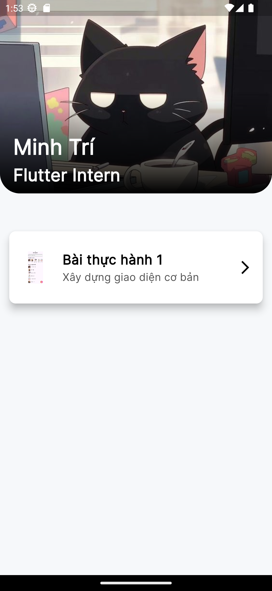
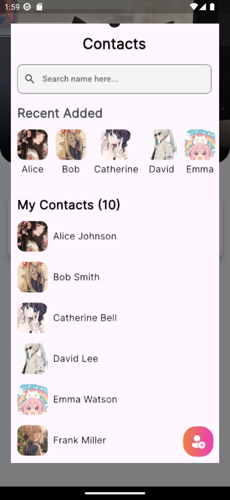
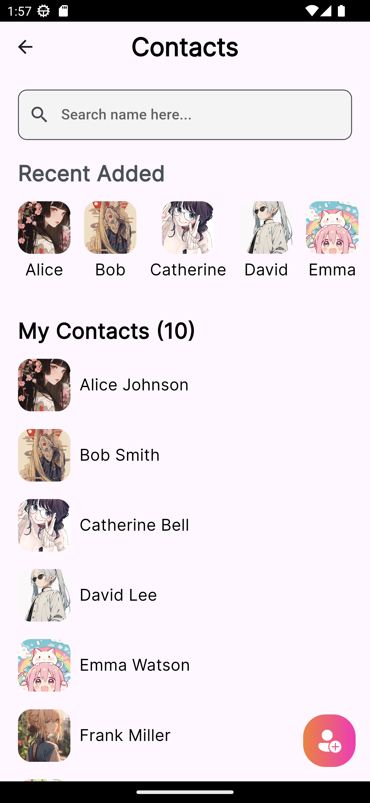

# Bài tập thực hành Intern Flutter

Các bài tập thực hành intern flutter theo từng tuần

## Overview
Màn hình chính hiển thị các bài làm (ấn giữ để hiển thị ảnh demo)

  
  

## Bài 1
UI màn hình danh bạ cơ bản

  

## Bài 2
UI màn hình App mua sắm cơ bản có route 3 màn

  
  
  

